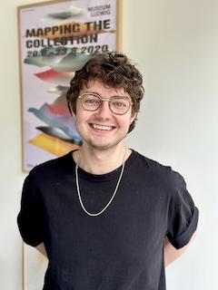

# Welcome to my page!
<divalign="right">

### I am currently training to a become a full-stack web developer at SPICED academy in Berlin. I am passionate about philosophy, mental health, and political economy, and am especially interested in the intersections of these feilds with technology. Talk to me about :
- human to human interfaces,
- health technologies,
- Web3,
- and books!

##### Find me on [Linkedin](https://www.linkedin.com/in/jamie-lawrence-822273118/) and [Instagram](https://www.instagram.com/jamezwilly)!
